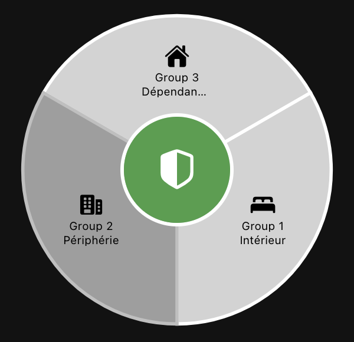

# Diagral Alarm Controller

A Main UI widget for arming/disarming a Diagral home alarm system
(`org.openhab.binding.diagral`), by zone or all at once: a pie-chart ring of
2–4 zone wedges around a single central shield button.



## What it does

- Draws a full-disc **pie chart**, one wedge per configured zone (2–4
  zones), filled grey when disarmed and `activeColor` (red by default) when
  armed.
- Tap a wedge to **select/deselect** that zone (client-side only — no
  command sent yet). A selected wedge darkens so it's visible regardless of
  its underlying color.
- Tap the **central button** to act:
  - No zone selected → arms/disarms **all** configured zones.
  - One or more zones selected → arms/disarms **only** those zones.
  - Mixed selection (some of the selected zones armed, some not) → the
    action is ambiguous, so the button shows a neutral/disabled state and
    does nothing until the selection is resolved.
- The central button's icon tint tells you what a tap will do: green =
  will arm, red = will disarm, grey = disabled/ambiguous, orange = **busy**
  (a command was just sent and hasn't been confirmed by the real Item state
  yet — clicking again during this window is suppressed so the same command
  isn't sent twice).
- Selection clears automatically after a successful tap.
- Optional cosmetic status caption under the ring, bound to the binding's
  own `armed-status` text.

One widget instance controls **one alarm system** (2–4 zones). Diagral
systems only ever have one panel per household, so multiple instances
aren't a expected use case.

## Prerequisites

- The `diagral` binding installed and configured (an `alarm-system` Thing,
  plus one `group` Thing per zone you want to control).
- The `alarm-system` Thing's Things/channels, per zone:
  - `activate-groups` (String, channel type `diagral:group-batch-activate`)
  - `disable-groups` (String, channel type `diagral:group-batch-disable`)

  Both take a comma-separated list of numeric group IDs and act on all of
  them in one Diagral API request. **This widget only ever sends batch
  commands to these two channels — it never sends `active` ON/OFF to a
  zone's own Item and never touches `mode-control`.** That's a deliberate
  design choice: sending one batch command per click is far more reliable
  against the real Diagral API than firing several simultaneous per-zone
  commands (which was tried first, and reliably raced/dropped zones under
  real household use — see [context.md](context.md) for the full story).
- Each zone's own `active` Switch channel, linked to a plain `Switch` Item.
  The widget reads these (never writes them) to show armed state and drive
  selection.
- Each zone's **numeric Diagral group ID** (assigned by the Diagral
  installer app — check via the group Thing, or via `/rest/things` /
  `/rest/links` if unsure). **This is not the same as the zone's position
  in the widget** — group IDs are commonly out of order (e.g. the zone you
  think of as "zone 1" might be Diagral group 3).

## Item setup

```java
String Diagral_Activate_Groups "Activate Groups" {channel="diagral:alarm-system:<bridge>:<alarm>:activate-groups"}
String Diagral_Disable_Groups  "Disable Groups"  {channel="diagral:alarm-system:<bridge>:<alarm>:disable-groups"}

Switch Diagral_Zone1_Active "Zone 1 Active" {channel="diagral:group:<bridge>:<group1>:active"}
Switch Diagral_Zone2_Active "Zone 2 Active" {channel="diagral:group:<bridge>:<group2>:active"}
Switch Diagral_Zone3_Active "Zone 3 Active" {channel="diagral:group:<bridge>:<group3>:active"}
Switch Diagral_Zone4_Active "Zone 4 Active" {channel="diagral:group:<bridge>:<group4>:active"}

String Diagral_Armed_Status "Armed Status" {channel="diagral:alarm-system:<bridge>:<alarm>:armed-status"}
```

Only `Diagral_Zone1_Active` is required. Leave zone 2/3/4 Items unset in
the widget config to run with fewer than 4 zones — no YAML editing needed,
just leave those config parameters empty. `Diagral_Armed_Status` is
optional and purely cosmetic.

## Widget setup

1. In Main UI, go to **Developer Tools → Widgets → +** and paste in the
   contents of [`widget.yaml`](widget.yaml). Save.
2. Add the widget to a page and set its config parameters to your items
   and group IDs from above.

## Config parameters

### Batch Control (required)

| Parameter | Type | Required | Description |
|---|---|---|---|
| `activateGroupsItem` | Item (String) | yes | Linked to `activate-groups` |
| `disableGroupsItem` | Item (String) | yes | Linked to `disable-groups` |

### Zone 1 / Zone 2 / Zone 3 / Zone 4

Zone 1 is required; zones 2–4 are optional — leave a zone's `Item` empty
to run with fewer wedges.

| Parameter | Type | Required | Default | Description |
|---|---|---|---|---|
| `zoneNItem` | Item (Switch) | zone 1 only | — | Linked to that zone's `active` channel. Read-only for this widget |
| `zoneNGroupId` | Integer | if `zoneNItem` set | — | The zone's real numeric Diagral group ID (not the zone slot number) |
| `zoneNLabel` | Text | no | `Zone N` | Label shown on the wedge |
| `zoneNIcon` | Icon | no | see below | Icon shown on the wedge |

Default icons: zone 1 `f7:house_fill`, zone 2 `f7:bed_double_fill`,
zone 3 `f7:building_2_fill`, zone 4 `f7:car_fill`.

### Colors

| Parameter | Type | Default | Description |
|---|---|---|---|
| `activeColor` | Color | `#e53935` | Wedge fill when that zone's `active` Item is ON |
| `selectedBorderColor` | Color | `#424242` | Reserved for a future selection-border style; selection is currently shown by darkening the wedge, so this parameter is unused today |
| `activateColor` | Color | `#43a047` | Central button tint when the tap will arm |
| `deactivateColor` | Color | `#e53935` | Central button tint when the tap will disarm |
| `pendingColor` | Color | `#fb8c00` | Central button tint while a just-sent command awaits confirmation from the real Item state |

### Status (optional)

| Parameter | Type | Required | Description |
|---|---|---|---|
| `armedStatusItem` | Item (String) | no | Linked to `armed-status`. Shown as a plain caption under the ring; not used in any control logic |

## Central button behavior

| Selection | Zone states | Central button |
|---|---|---|
| None | All zones disarmed | Green — tap arms all zones |
| None | All zones armed | Red — tap disarms all zones |
| None | Mixed | Grey/disabled — no single unambiguous action |
| One or more zones | All selected zones disarmed | Green — tap arms only the selected zones |
| One or more zones | All selected zones armed | Red — tap disarms only the selected zones |
| One or more zones | Selected zones have mixed state | Grey/disabled |
| (any) | Command just sent, not yet confirmed | Orange/"busy" — tap suppressed to avoid a duplicate send |

Selection clears automatically after a tap that actually sends a command.

## Known limitations

- **The Diagral binding polls rather than pushes** — a real Item's state
  can lag the physical alarm's actual state by tens of seconds, and has
  been observed to briefly flap on its own with no widget-originated
  command in flight. This widget's own command dispatch has been verified
  correct independently (exactly one batch command per tap, to the right
  Item, with the right group IDs) — apparent "it didn't work" behavior is
  almost always binding/hardware latency, not the widget.
- No hard timeout on the busy/pending state — since Main UI's expression
  evaluator has no reactive clock, a target that never gets confirmed by
  the real Items stays "pending" until it is, or until the page reloads
  (which always clears it instantly, since `vars.*` don't persist across
  reloads).
- Rapid double-clicking the central button immediately after a send that
  clears the selection can end up targeting *all* zones (empty selection =
  "act on everything") rather than being recognized as a repeat of the
  first click — a known, accepted tradeoff of clearing the selection after
  each send. See [context.md](context.md), "Fourth follow-up," for details.
- `selectedBorderColor` config parameter exists but is currently unused —
  selection is shown by darkening the wedge, not by a border.
- Hard cap of 4 zones (4 fixed parameter slots, not a dynamic list).

See [context.md](context.md) for the full build history, every live-tested
gotcha (Main UI expression evaluator limits, `oh-repeater`/CSS Grid
pitfalls, Framework7 `oh-link` defaults, etc.), and the reasoning behind
each design decision.
