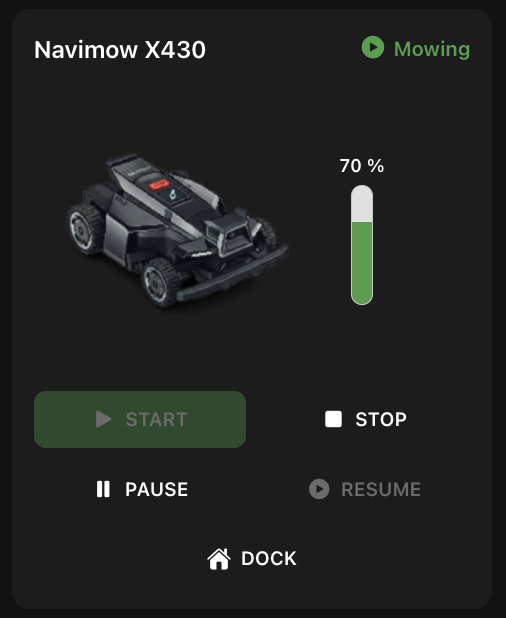

# Navimow Mower Card

A Main UI widget for controlling and monitoring a single Segway Navimow
robotic lawn mower via the `navimow` openHAB binding.



## What it does

- Shows the mower's current **activity** (idle, mowing, paused, docked,
  charging, returning, error, unknown) as a colored icon + label.
- Shows **battery level** as a vertical gauge, colored red/amber/green by
  threshold.
- Shows a **product image** picked automatically from the mower's model
  (falls back to a generic silhouette if the model isn't recognized).
- Provides a 5-button control pad — **START / STOP / PAUSE / RESUME /
  DOCK** — that only enables the buttons valid for the current activity,
  and highlights the one that reflects it.

One widget instance controls **one mower**. If you have several mowers,
add one widget instance per mower.

## Prerequisites

- The `navimow` binding installed and configured (an `navimow:account`
  bridge Thing with your Segway credentials, and one `navimow:mower` Thing
  per mower).
- Four Items linked to that Thing's channels.

## Item setup

```java
String Navimow_Activity "Navimow Activity" {channel="navimow:mower:<account>:<mower>:activity"}
String Navimow_Control  "Navimow Control"  {channel="navimow:mower:<account>:<mower>:control"}
Number Navimow_Battery  "Navimow Battery"  {channel="navimow:mower:<account>:<mower>:battery-level"}
String Navimow_Model    "Navimow Model"    {channel="navimow:mower:<account>:<mower>:model"}
```

**Important:** `Navimow_Battery` must be a plain `Number` item, **not**
`Number:Dimensionless`. The `battery-level` channel's `%` is cosmetic
display formatting, not a real unit — linking it as `Number:Dimensionless`
makes openHAB multiply the value by 100 (e.g. 85% shown as 8500%).

## Widget setup

1. In Main UI, go to **Developer Tools → Widgets → +** and paste in the
   contents of [`widget.yaml`](widget.yaml). Save.
2. Add the widget to a page (or an Equipment representation) and set its
   config parameters to your four items from above.

## Config parameters

| Parameter | Type | Required | Description |
|---|---|---|---|
| `activityItem` | Item (String) | yes | Linked to the `activity` channel |
| `controlItem` | Item (String) | yes | Linked to the `control` channel |
| `batteryItem` | Item (Number) | yes | Linked to the `battery-level` channel |
| `modelItem` | Item (String) | yes | Linked to the `model` channel |
| `maxWidth` | Text | no | CSS max-width of the card. Defaults to `20rem` |
| `title` | Text | no | Overrides the card header text. Defaults to `"Navimow " + <model>` (e.g. "Navimow X430"), or `"Mower"` if the model isn't available yet |

## Model image

The product image is chosen from the first 2 characters of the model
string (e.g. `X430` → `X4`, `i110` → `i1`). Images currently bundled in
the widget:

| Category | Example models |
|---|---|
| `H2` | H-Series |
| `i1` | i-Series (i110, ...) |
| `i2` | i-Series (i2xx, ...) |
| `X3` | X3-Series |
| `X4` | X4-Series (X430, X450, ...) |

Any model outside these categories shows a generic default silhouette
instead — nothing breaks, it just won't have a model-specific picture
until one is added.

## Button behavior

| Activity | Enabled buttons | Highlighted |
|---|---|---|
| Idle | START | — |
| Mowing | PAUSE, STOP, DOCK | START |
| Paused | RESUME, STOP, DOCK | PAUSE |
| Docked | START | DOCK |
| Charging | START | DOCK |
| Returning | STOP | DOCK |
| Error | STOP | — |
| Unknown | none | — |

Disabled buttons stay visible but greyed out, so the layout never shifts.
Note the binding doesn't distinguish between a `STOP` and a `PAUSE` once
sent — both settle into the same "paused" activity.

## Known limitations

- No mower position/GPS — not exposed by the binding.
- No schedule, blade height, or zone/map data.
- No offline/"unreachable" indicator yet if the Thing itself goes offline.
